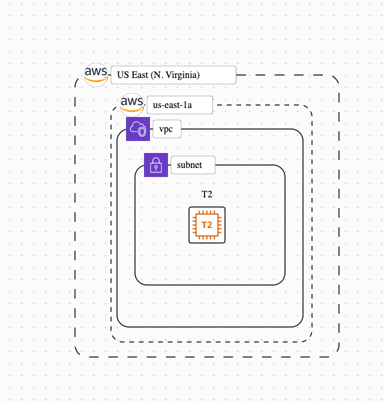
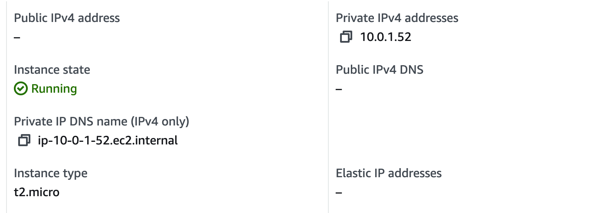

## Terraform will create the following resources:
This project is intend to build a an infrastructure on AWS.
We are planning to create an EC2 instance in an VPC and host in us-east-1a as the bellow diagram shows.



``` $ terraform plan ```
  # aws_instance.my-instance will be created
  ```+ resource "aws_instance" "my-instance" {
      + ami                                  = "ami-065bb5126e4504910"
      + arn                                  = (known after apply)
      + associate_public_ip_address          = (known after apply)
      + availability_zone                    = (known after apply)
      + cpu_core_count                       = (known after apply)
      + cpu_threads_per_core                 = (known after apply)
      + disable_api_stop                     = (known after apply)
      + disable_api_termination              = (known after apply)
      + ebs_optimized                        = (known after apply)
      + get_password_data                    = false
      + host_id                              = (known after apply)
      + host_resource_group_arn              = (known after apply)
      + iam_instance_profile                 = (known after apply)
      + id                                   = (known after apply)
      + instance_initiated_shutdown_behavior = (known after apply)
      + instance_state                       = (known after apply)
      + instance_type                        = "t2.micro"
      + ipv6_address_count                   = (known after apply)
      + ipv6_addresses                       = (known after apply)
      + key_name                             = (known after apply)
      + monitoring                           = (known after apply)
      + outpost_arn                          = (known after apply)
      + password_data                        = (known after apply)
      + placement_group                      = (known after apply)
      + placement_partition_number           = (known after apply)
      + primary_network_interface_id         = (known after apply)
      + private_dns                          = (known after apply)
      + private_ip                           = (known after apply)
      + public_dns                           = (known after apply)
      + public_ip                            = (known after apply)
      + secondary_private_ips                = (known after apply)
      + security_groups                      = (known after apply)
      + source_dest_check                    = true
      + subnet_id                            = (known after apply)
      + tags_all                             = (known after apply)
      + tenancy                              = (known after apply)
      + user_data                            = (known after apply)
      + user_data_base64                     = (known after apply)
      + user_data_replace_on_change          = false
      + vpc_security_group_ids               = (known after apply)

      + capacity_reservation_specification {
          + capacity_reservation_preference = (known after apply)

          + capacity_reservation_target {
              + capacity_reservation_id                 = (known after apply)
              + capacity_reservation_resource_group_arn = (known after apply)
            }
        }

      + ebs_block_device {
          + delete_on_termination = (known after apply)
          + device_name           = (known after apply)
          + encrypted             = (known after apply)
          + iops                  = (known after apply)
          + kms_key_id            = (known after apply)
          + snapshot_id           = (known after apply)
          + tags                  = (known after apply)
          + throughput            = (known after apply)
          + volume_id             = (known after apply)
          + volume_size           = (known after apply)
          + volume_type           = (known after apply)
        }

      + enclave_options {
          + enabled = (known after apply)
        }

      + ephemeral_block_device {
          + device_name  = (known after apply)
          + no_device    = (known after apply)
          + virtual_name = (known after apply)
        }

      + maintenance_options {
          + auto_recovery = (known after apply)
        }

      + metadata_options {
          + http_endpoint               = (known after apply)
          + http_put_response_hop_limit = (known after apply)
          + http_tokens                 = (known after apply)
          + instance_metadata_tags      = (known after apply)
        }

      + network_interface {
          + delete_on_termination = (known after apply)
          + device_index          = (known after apply)
          + network_card_index    = (known after apply)
          + network_interface_id  = (known after apply)
        }

      + private_dns_name_options {
          + enable_resource_name_dns_a_record    = (known after apply)
          + enable_resource_name_dns_aaaa_record = (known after apply)
          + hostname_type                        = (known after apply)
        }

      + root_block_device {
          + delete_on_termination = (known after apply)
          + device_name           = (known after apply)
          + encrypted             = (known after apply)
          + iops                  = (known after apply)
          + kms_key_id            = (known after apply)
          + tags                  = (known after apply)
          + throughput            = (known after apply)
          + volume_id             = (known after apply)
          + volume_size           = (known after apply)
          + volume_type           = (known after apply)
        }
    }

  # module.vpc.aws_subnet.this will be created
  + resource "aws_subnet" "this" {
      + arn                                            = (known after apply)
      + assign_ipv6_address_on_creation                = false
      + availability_zone                              = (known after apply)
      + availability_zone_id                           = (known after apply)
      + cidr_block                                     = "10.0.1.0/24"
      + enable_dns64                                   = false
      + enable_resource_name_dns_a_record_on_launch    = false
      + enable_resource_name_dns_aaaa_record_on_launch = false
      + id                                             = (known after apply)
      + ipv6_cidr_block_association_id                 = (known after apply)
      + ipv6_native                                    = false
      + map_public_ip_on_launch                        = false
      + owner_id                                       = (known after apply)
      + private_dns_hostname_type_on_launch            = (known after apply)
      + tags_all                                       = (known after apply)
      + vpc_id                                         = (known after apply)
    }

  # module.vpc.aws_vpc.this will be created
  + resource "aws_vpc" "this" {
      + arn                                  = (known after apply)
      + cidr_block                           = "10.0.0.0/16"
      + default_network_acl_id               = (known after apply)
      + default_route_table_id               = (known after apply)
      + default_security_group_id            = (known after apply)
      + dhcp_options_id                      = (known after apply)
      + enable_classiclink                   = (known after apply)
      + enable_classiclink_dns_support       = (known after apply)
      + enable_dns_hostnames                 = (known after apply)
      + enable_dns_support                   = true
      + enable_network_address_usage_metrics = (known after apply)
      + id                                   = (known after apply)
      + instance_tenancy                     = "default"
      + ipv6_association_id                  = (known after apply)
      + ipv6_cidr_block                      = (known after apply)
      + ipv6_cidr_block_network_border_group = (known after apply)
      + main_route_table_id                  = (known after apply)
      + owner_id                             = (known after apply)
      + tags_all                             = (known after apply)
    }
```
Plan: 3 to add, 0 to change, 0 to destroy.

Changes to Outputs:
  + PrivateIP = (known after apply)


  Note: You didn't specify an "-out" parameter to save this plan, so Terraform
can't guarantee that exactly these actions will be performed if
"terraform apply" is subsequently run.


 ``` $ terraform apply --auto-approve```

module.vpc.aws_vpc.this: Creating...
module.vpc.aws_vpc.this: Creation complete after 1s [id=vpc-018d5e62f731dd60a]
module.vpc.aws_subnet.this: Creating...
module.vpc.aws_subnet.this: Creation complete after 0s [id=subnet-04a39e75bb8c1c191]
aws_instance.my-instance: Creating...
aws_instance.my-instance: Still creating... [10s elapsed]
aws_instance.my-instance: Still creating... [20s elapsed]
aws_instance.my-instance: Creation complete after 21s [id=i-01d7a8a6a83c7b13e]

Apply complete! Resources: 3 added, 0 changed, 0 destroyed.

Outputs:

  $ PrivateIP = "10.0.1.52"

## Velify on AWS


Feel free to use this HCL code in your project. Thank you!